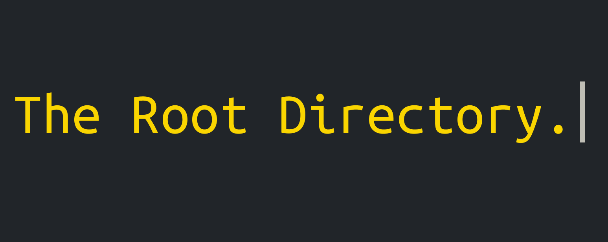

 

 

 
 
 
 

 
---
## About
The Root Directory is an open-source project that focuses on tech writing by and for the community. 

**Stack & conventions:**

- Python 3.13, Django 6.0.2
- Psycopg 3.3 (PostgreSQL)
- Ruff for linting & formatting
- Semantic versioning 2.0.0 [More information](https://semver.org/spec/v2.0.0.html)
- Angular commit message conventions
- PRs require at least one maintainer review and must pass all CI checks
 
---
 

 
MIT License · Built in the open · [https://github.com/thefossproject/the-root-directory](https://github.com/thefossproject/the-root-directory)
 

